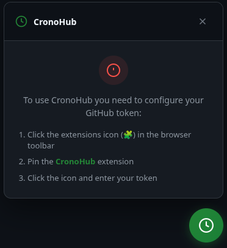
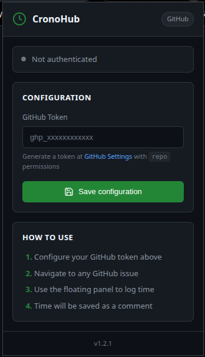
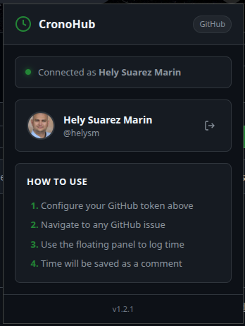
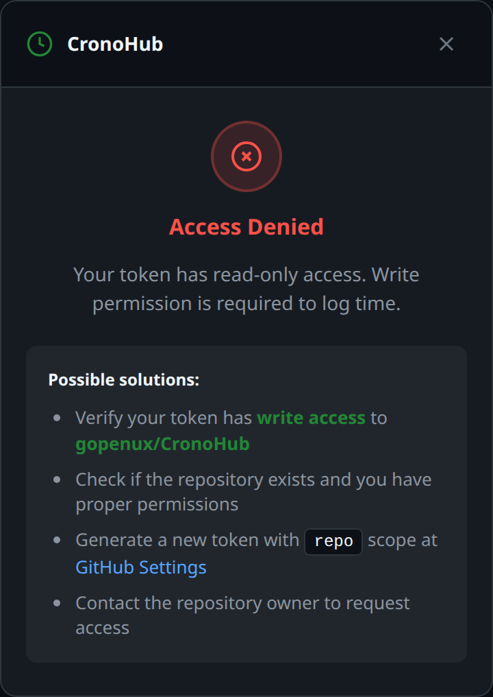
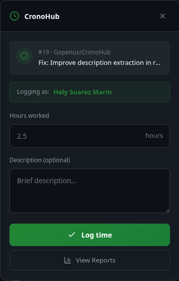
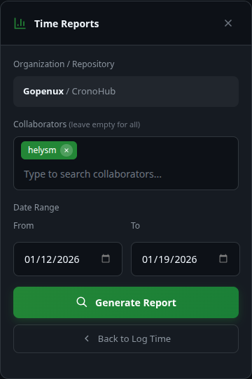

<div align="center">


# CronoHub

### **Professional Time Tracking for GitHub Issues**

**Track time effortlessly. Generate reports instantly. Your data stays yours.**

[](https://github.com/Gopenux/CronoHub/releases)
[](LICENSE)
[](https://www.google.com/chrome/)
[](https://developer.chrome.com/docs/extensions/mv3/)
[](https://github.com/Gopenux/CronoHub/actions)

[](https://github.com/sponsors/Gopenux)
[](https://gopenux.com)

[🚀 Get Started](#-installation) • [✨ Features](#-highlights) • [📖 How to Use](#-how-to-use) • [💝 Support Us](#-support-our-work)

---

</div>

## 🎯 Why CronoHub?

CronoHub was born from a **real need** at [Gopenux](https://gopenux.com), a Colombian software development company with years of experience building enterprise solutions.

### The Challenge

Our development teams needed a way to track time on GitHub issues without:
- ❌ Leaving their workflow to use external tools
- ❌ Manually updating spreadsheets (tedious and error-prone)
- ❌ Sharing sensitive data with third-party services
- ❌ Spending hours compiling team reports

### Our Solution

We built **CronoHub** – a Chrome extension that integrates seamlessly into GitHub:
- ✅ Log time directly on issues with one click
- ✅ Automatic formatting as professional GitHub comments
- ✅ Generate multi-user reports instantly
- ✅ **100% local** – your data never leaves GitHub
- ✅ Zero data collection – your privacy guaranteed

**We found it so useful, we're sharing it with everyone** under the MIT License.

---

## ✨ Highlights

<table>
<tr>
<td width="50%" valign="top">

### ⚡ Lightning Fast Setup
- Install in under 2 minutes
- Add your GitHub token
- **Proactive permission validation**
- Start tracking immediately
- No account creation required

</td>
<td width="50%" valign="top">

### 🔒 Privacy Guaranteed
- Zero data collection
- Token stored locally in your browser
- All API calls direct to GitHub
- Open source – audit the code yourself

</td>
</tr>
<tr>
<td width="50%" valign="top">

### 📊 Powerful Reports
- Multi-user time aggregation
- Date range filtering (up to 90 days)
- Smart collaborator selector
- 99.6% API optimization

</td>
<td width="50%" valign="top">

### 🛠️ Enterprise Quality
- 177 automated tests (100% coverage)
- Manifest V3 compliant
- XSS protection
- Daily compatibility testing

</td>
</tr>
</table>

---

## 📸 See It In Action

### Step 1: Initial Setup Instructions

When you first install CronoHub, you'll see helpful setup instructions:

<div align="center">


*Quick guide to get started: pin the extension and configure your token.*
</div>

### Step 2: Configure Your Token (One Time)

<div align="center">


*Simple, secure token configuration. Your token never leaves your browser.*
</div>

### Step 3: Verify Connection

<div align="center">


*Extension automatically identifies you using your GitHub account.*
</div>

### Step 4: Permission Validation (Automatic)

When you open the panel, CronoHub automatically validates your token's permissions:

<div align="center">


*If your token lacks write access, you'll see clear guidance on how to fix it.*
</div>

**What's validated:**
- ✅ Repository exists and you have read access
- ✅ Your token has **write permission** (required to post comments)
- ✅ No rate limiting or network issues

**If validation fails**, you'll see:
- 🔴 **Access Denied** - Clear error message explaining the issue
- 💡 **Possible Solutions** - Step-by-step guidance to fix the problem
- 🔗 **Quick Links** - Direct links to GitHub settings to regenerate token

This **proactive validation** prevents you from filling out the form only to receive an error on submit.

### Step 5: Log Time on Any Issue

<div align="center">


*Floating panel appears on every GitHub issue. Enter hours, add description, done.*
</div>

> **📌 Important Note**: The floating button (⏱️) **only appears on GitHub issue pages**. This includes:
> - Classic issue view: `github.com/:owner/:repo/issues/:number`
> - GitHub Projects side panel when viewing an issue
>
> The button will **not** appear on repository home pages, pull requests, or other GitHub pages.

### Step 6: Generate Team Reports

<div align="center">


*Select team members, choose date range, and generate instant reports.*
</div>

### Step 7: Analyze Results

<div align="center">


*Detailed breakdown with totals, dates, and **smart clickable links** to time entries.*
</div>

**Smart Navigation Features:**

The report includes intelligent navigation with dual clickable links:

- **Issue Number** (e.g., `#33`): Click to navigate to the issue
  - Opens the issue at the **top** (beginning of the page)
  - Opens in a **new tab** if different from current issue
  - **Scrolls to top** if you're already viewing that issue

- **Description** (e.g., "Created categories data model"): Click to navigate to the specific comment
  - Opens the issue and **scrolls directly to the time tracking comment**
  - Opens in a **new tab** if different from current issue
  - **Scrolls to comment** if you're already viewing that issue

This dual-link approach gives you flexibility: quick issue overview or direct comment access.

---

## 🚀 Installation

### Prerequisites
- Google Chrome (Stable or Beta)
- GitHub Personal Access Token ([create one here](https://github.com/settings/tokens))
  - **Required scope**: `repo` (Full control of private repositories)
    - This includes: read user info, read/write issues, read comments, search repositories
  - **Recommended**: Grant access to **all repositories** to use CronoHub across all your projects
  - **Alternative**: Grant access to **specific repositories** if you only need it for certain projects
  - See [Token Permissions](#-about-token-permissions) below for detailed explanation

### Install Steps

```bash
# 1. Clone the repository
git clone https://github.com/Gopenux/CronoHub.git
cd CronoHub
```

```
2. Open Chrome and navigate to chrome://extensions/
3. Enable "Developer mode" (toggle in top-right corner)
4. Click "Load unpacked" button
5. Select the CronoHub folder
6. Click the CronoHub extension icon in your toolbar
7. Paste your GitHub token
8. Click "Save configuration"
```

**✅ Installation complete!** Navigate to any GitHub issue to start tracking time.

### 🔑 About Token Permissions

#### Required Permissions

For CronoHub to work correctly, your GitHub Personal Access Token **must have** the following scope:

**`repo` (Full control of private repositories)**

This scope grants access to:
- ✅ **`repo:status`** - Read commit status (required for API access)
- ✅ **`repo_deployment`** - Read deployment status
- ✅ **`public_repo`** - Read and write to public repositories
- ✅ **`repo:invite`** - Access to repository invitations
- ✅ **Write access to issues** - Required to post time tracking comments

> ⚠️ **Important**: The `repo` scope is necessary because CronoHub needs to:
> 1. **Read** your user information and organization members
> 2. **Read** issue comments to generate reports
> 3. **Write** time tracking comments to issues
> 4. **Search** across repositories for time entries

#### Repository Access Options

When creating your token, choose how broadly it should work:

**Option 1: All Repositories (Recommended)**
- Grant the token access to **all repositories**
- ✅ Use CronoHub on any repository you have access to
- ✅ No need to regenerate tokens for new projects
- ✅ Seamless experience across your entire GitHub account

**Option 2: Specific Repositories**
- Grant the token access to **selected repositories only**
- ✅ More granular security control
- ✅ Useful if you only track time on specific projects
- ⚠️ Will need to update token permissions to add new repositories later

> **💡 Tip**: Most users prefer "All Repositories" for convenience. Your token is stored locally and never shared with external services, so the broader access is safe.

---

## 📖 How to Use

### Logging Time

> **⚠️ Important**: The CronoHub floating button only appears on **GitHub issue pages**. Make sure you're viewing an issue (either in classic view or GitHub Projects side panel) to see the time tracking button.

<table>
<tr>
<td width="30%">

**1. Navigate to Issue**

Open any GitHub issue (works in classic view and GitHub Projects)

</td>
<td width="30%">

**2. Click Button**

Look for the green floating button (⏱️) in the bottom-right corner

</td>
<td width="40%">

**3. Enter Time**

Input hours (e.g., `2.5`) and optional description, then click "Log Time"

</td>
</tr>
</table>

**Your time entry is posted as a formatted comment:**

```markdown
⏱️ **Time Tracked:** 2.5 Hours

Implemented user authentication and session management

---
Logged with CronoHub by Gopenux AI Team
```

### Viewing Reports

<table>
<tr>
<td width="25%">

**1. Open Panel**

Click the CronoHub button

</td>
<td width="25%">

**2. Switch Mode**

Select "Reports" tab

</td>
<td width="25%">

**3. Select Team**

Choose collaborators (you're pre-selected)

</td>
<td width="25%">

**4. Generate**

Pick date range and click "Generate Report"

</td>
</tr>
</table>

**Report Features:**
- Total hours per user and grand total
- Breakdown by date (collapsible sections)
- **Smart dual clickable links**:
  - Issue number → navigates to issue top
  - Description → navigates to specific comment
- Context-aware navigation (new tab vs. scroll)
- Support for up to 90-day ranges

---

## 🛡️ Privacy & Security

### Our Commitment

**We don't collect ANY data. Ever.**

This is not marketing speak – it's architecturally guaranteed:

| Aspect | How We Protect You |
|--------|-------------------|
| **Token Storage** | Stored locally in `chrome.storage.local` – never sent to external servers |
| **API Calls** | Direct to `api.github.com` – no intermediary services |
| **Data Collection** | Zero telemetry, zero analytics, zero tracking |
| **Open Source** | MIT License – audit every line of code yourself |
| **Manifest V3** | Modern security standards enforced by Chrome |

### Why Trust Us?

1. **Open Source**: Every line of code is public on GitHub
2. **Local-First**: All processing happens in your browser
3. **No Backend**: We don't operate any servers that could collect data
4. **Reputable Team**: Built by Gopenux, a Colombian company with years of enterprise experience

---

## 🏗️ Technical Excellence

### Built with Quality Standards

<table>
<tr>
<td width="50%">

**Modern Architecture**
- ✅ Manifest V3 compliant
- ✅ Adaptive UI rendering (DOM/iframe)
- ✅ Centralized state management
- ✅ SPA navigation detection

</td>
<td width="50%">

**Optimized Performance**
- ✅ 99.6% API efficiency (500KB → 10KB)
- ✅ Single-pass data processing
- ✅ Memory-efficient algorithms
- ✅ Smart GitHub API queries

</td>
</tr>
<tr>
<td width="50%">

**Comprehensive Testing**
- ✅ 177 automated tests
- ✅ 100% functional coverage
- ✅ Daily Chrome compatibility tests
- ✅ Mocked API testing (no token needed)

</td>
<td width="50%">

**Security First**
- ✅ XSS prevention with HTML escaping
- ✅ Secure token storage
- ✅ Input validation
- ✅ OWASP best practices

</td>
</tr>
</table>

### Test Status


- **Daily Runs**: Automated tests every day at 2:00 AM UTC
- **PR Validation**: All pull requests tested before merge
- **Auto Issue Creation**: Failed tests create GitHub issues automatically
- **Multi-Version**: Tests run on Chrome Stable and Beta

---

## 🌟 About Gopenux

<div align="center">

</div>

**Gopenux** is a Colombian software development company with years of experience delivering high-quality enterprise solutions. We specialize in building tools that solve real problems for development teams.

### Why We Built CronoHub

Time tracking was a pain point in our projects. We needed:
- Seamless GitHub integration
- Multi-user reporting
- Zero data leakage
- Professional-grade quality

When we couldn't find a solution that met all requirements, **we built it ourselves**.

### Our Values

| Value | What It Means |
|-------|---------------|
| 🔓 **Open Source** | MIT License – free to use, modify, and distribute |
| 🔐 **Privacy First** | Your data stays yours – we never collect anything |
| 🔄 **Community Driven** | We fix bugs and add features based on user feedback |
| 🇨🇴 **Made in Colombia** | Proud to contribute to the global open source community |

**Learn more about our work**: [gopenux.com](https://gopenux.com)

---

## 💝 Support Our Work

If CronoHub saves you time and improves your workflow, please consider supporting our development:

<div align="center">

[](https://github.com/sponsors/Gopenux)

### Every Contribution Helps Us:

</div>

<table>
<tr>
<td width="25%" align="center">

🐛

**Fix Bugs Faster**

Dedicate more time to addressing issues

</td>
<td width="25%" align="center">

✨

**Add Features**

Develop requested functionality

</td>
<td width="25%" align="center">

📖

**Improve Docs**

Create tutorials and guides

</td>
<td width="25%" align="center">

🚀

**Keep It Free**

Maintain the project for everyone

</td>
</tr>
</table>

<div align="center">

**Sponsors get:**
- 🎖️ Recognition in our README
- 🔔 Priority support for issues
- 📣 Early access to new features
- 💬 Direct line to the dev team

[Become a Sponsor →](https://github.com/sponsors/Gopenux)

</div>

---

## 📝 Comment Format Reference

Time entries follow this standardized GitHub markdown format:

```markdown
⏱️ **Time Tracked:** {hours} Hour(s)

{optional description of work performed}

---
<sub>Logged with CronoHub by Gopenux AI Team</sub>
```

**Why this format?**
- ⏱️ **Visual identification**: Easy to spot in issue timelines
- 📊 **Report parsing**: Consistent pattern for automatic aggregation
- 💼 **Professional appearance**: Clean, readable format
- 🔍 **Transparency**: Clear attribution to the tool

---

## 🤝 Contributing

We welcome contributions from the community! Here's how you can help:

### Ways to Contribute

<table>
<tr>
<td width="25%" align="center">

🐛

**Report Bugs**

[Open an issue](https://github.com/Gopenux/CronoHub/issues/new?template=bug_report.md)

</td>
<td width="25%" align="center">

💡

**Request Features**

[Suggest ideas](https://github.com/Gopenux/CronoHub/issues/new?template=feature_request.md)

</td>
<td width="25%" align="center">

📖

**Improve Docs**

Submit documentation updates

</td>
<td width="25%" align="center">

🔧

**Submit Code**

Create pull requests

</td>
</tr>
</table>

### Contribution Guidelines

1. Fork the repository
2. Create a feature branch (`git checkout -b feature/amazing-feature`)
3. Write tests for new functionality
4. Ensure all tests pass (`npm test`)
5. Commit your changes with clear, descriptive messages
6. Push to your branch
7. Open a Pull Request

**Note**: All PRs are automatically tested before merge.

---

## 🧪 Development & Testing

### For Developers

```bash
# Clone repository
git clone https://github.com/Gopenux/CronoHub.git
cd CronoHub

# Install dependencies
npm install

# Run all tests
npm test

# Run specific test suites
npm run test:unit          # Unit tests only (141 tests)
npm run test:e2e           # End-to-end tests (36 tests)
npm run test:coverage      # Generate coverage report
npm run test:watch         # Watch mode for development

# Linting
npm run lint
npm run lint:fix

# Validate manifest
npm run validate:manifest
```

### Project Structure

```
CronoHub/
├── manifest.json              # Extension config (Manifest V3)
├── background.js              # Service worker
├── content.js                 # Main UI & time logging
├── reports.js                 # Reports module & API calls
├── popup.html / popup.js      # Extension popup & auth
├── styles/
│   ├── content.css            # Panel & button styles
│   └── popup.css              # Popup window styles
├── icons/                     # Extension icons (16, 48, 128)
├── docs/
│   └── screenshots/           # README images
├── tests/
│   ├── unit/                  # Unit tests (141 tests)
│   ├── e2e/                   # E2E tests (36 tests)
│   └── mocks/                 # Reusable API mocks
└── .github/workflows/         # CI/CD with GitHub Actions
```

---

## 📄 License

**MIT License** – Copyright © 2026 Gopenux AI Team

Permission is hereby granted, free of charge, to any person obtaining a copy of this software and associated documentation files (the "Software"), to deal in the Software without restriction, including without limitation the rights to use, copy, modify, merge, publish, distribute, sublicense, and/or sell copies of the Software, subject to the following conditions:

The above copyright notice and this permission notice shall be included in all copies or substantial portions of the Software.

**THE SOFTWARE IS PROVIDED "AS IS", WITHOUT WARRANTY OF ANY KIND.**

[Read Full License →](LICENSE)

---

## 🔗 Quick Links

<div align="center">

| Resource | Link |
|----------|------|
| 🌐 **Company Website** | [gopenux.com](https://gopenux.com) |
| 📦 **GitHub Repository** | [github.com/Gopenux/CronoHub](https://github.com/Gopenux/CronoHub) |
| 🐛 **Report Issues** | [GitHub Issues](https://github.com/Gopenux/CronoHub/issues) |
| 💡 **Feature Requests** | [Request a Feature](https://github.com/Gopenux/CronoHub/issues/new?template=feature_request.md) |
| 💝 **Sponsor Project** | [GitHub Sponsors](https://github.com/sponsors/Gopenux) |
| 🧪 **Test Documentation** | [tests/README.md](tests/README.md) |

</div>

---

## 🏆 Acknowledgments

**Built with love by the [Gopenux AI Team](https://gopenux.com)**

Special thanks to:
- The GitHub team for the excellent API
- The Chrome Extensions team for Manifest V3
- The open source community for inspiration
- Our users for feedback and support

---

## 📊 Project Stats

<div align="center">

[](https://github.com/Gopenux/CronoHub/stargazers)
[](https://github.com/Gopenux/CronoHub/network/members)
[](https://github.com/Gopenux/CronoHub/issues)
[](https://github.com/Gopenux/CronoHub/pulls)

</div>

---

<div align="center">

### ⭐ If CronoHub helps you, give us a star!

**Made with ❤️ in Colombia 🇨🇴**

*Empowering developers with better tools, one extension at a time.*

---


[](https://opensource.org/licenses/MIT)

**© 2026 Gopenux AI Team • MIT License**

</div>
